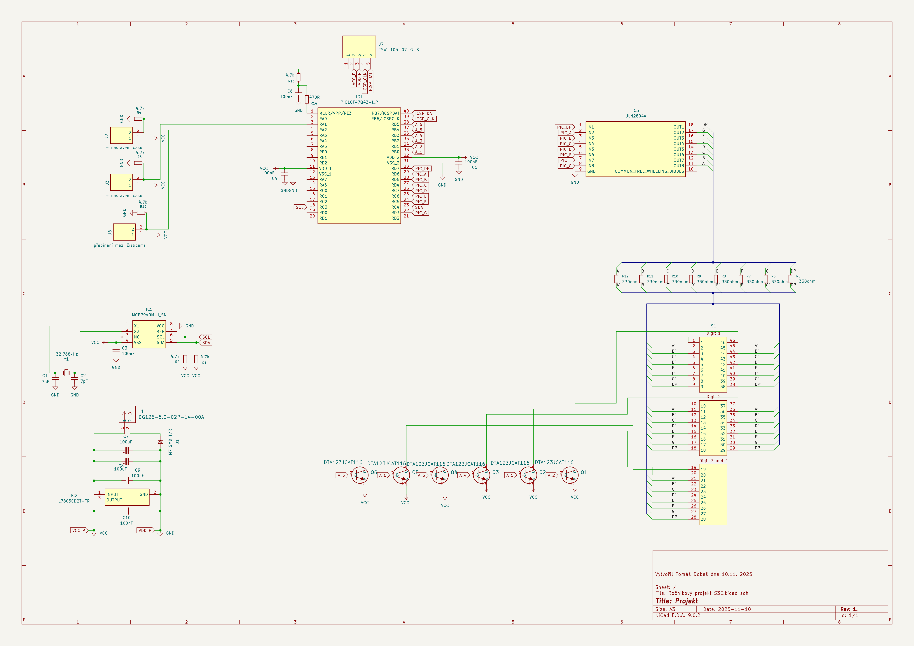
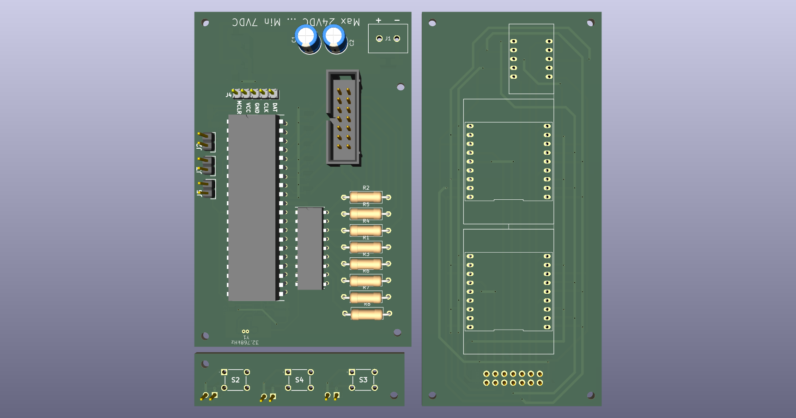
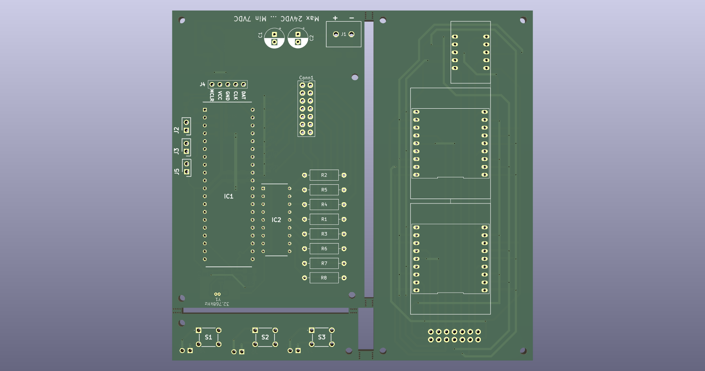
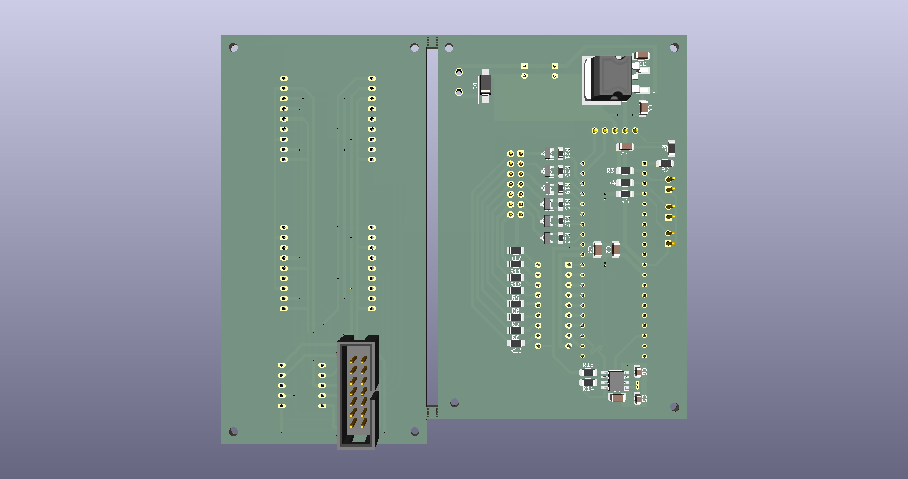
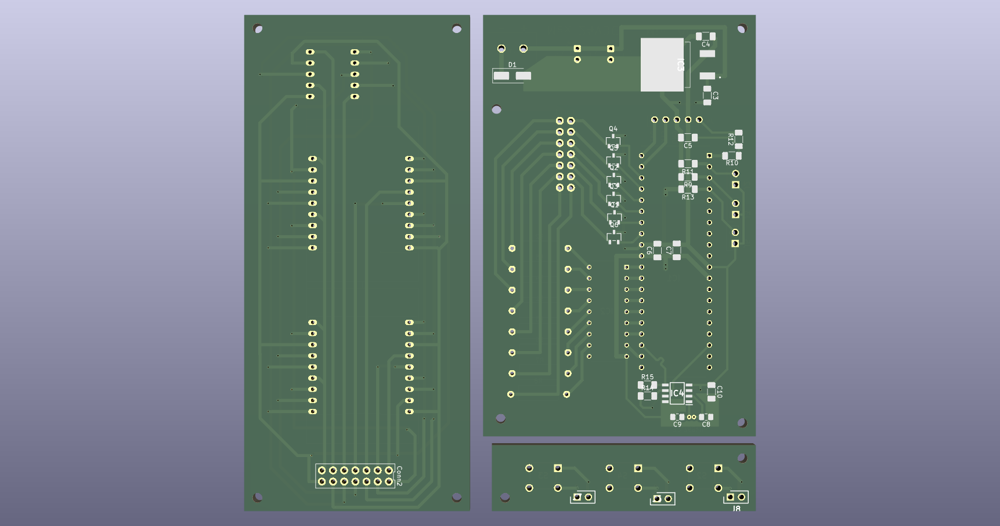

# Ročníkový projekt S3E Dobeš Tomáš Digitální hodiny
## Zvláštní poděkování
Zvláště bych chtěl poděkovat panu Miroslavu Máchovi za rady a pomoc při výběru součástek a řešení problémů konstrukčního typu.
A také  panu Jiřímu Vinterovi za rady a kontakty.

## To-do list
- [x] Navrhnout schéma 
- [x] Objednat součástky
- [ ] Otestovat na breadboardu
- [x] Navrhnout PCB
- [ ] Vyrobit PCB osadit, otestovat

## Princip a popis
Původní myšlenka jak zhotovit tento obvod byla, že by se jednotlivé výstupy na zobrazovače připojily přes posuvné registry, ovšem bylo by jich zapotřebí 6 kousků (HH:mm:ss) převod časového údaje z RTC by bylo zhotoveno přímo v PIC.

Po konzultaci s panem Máchou by bylo lepší Multiplexovat číslice 1:6 tzn. že v jednom okamžiku problikne jeden segment, takto se "probliká" každý segment zvlášť v určité rychlosti(Hz), od určité rychlosti ± 30 Hz se obraz jeví jako spojitý.[1]
### Blokové schéma

<figure>
  
  <figcaption align="center"><i>Obrázek 1: Blokové schéma zapojení hodin</i></figcaption>
</figure>

### Součástky a jejich funkce v obvodu
V této podkapitole budou popsány hlavně podstatné součástky RTC, PIC, tranzistorové pole a samotné tranzistory (touto částí obvodu se chápe zobrazovací část. Vzhledem ke složitosti projektu zde nebude popsáno jak každý samostatný prvek funguje. 

- Obecné informace na vstupu napětí jsou  umístěny tzv. Tank Capacitors[2, kap. 4.2.2], jsou to dva kondenzátory 100uF/35V na napájení jejich funkce zajišťuje stabilní napětí při náhlém zvětšení proudového zatížení. Každý IO napájený z VCC má připojený tzv. Decoupling Capacitors[10] tyto kondenzátory mají na starosti odrušení od možných na indukovaných vysokých frekvencí, všechny mají hodnotu 100nF. Dále je v obvodu implementována dioda která obvod chrání před přepólováním její úbytek je ± 1100mV[11], takže velikost napájecího napětí bude 6V (6-1 = 5V) maximální napětí všech IO je 5,5V. Před vyrobením PCB bude zdroj otestován na stabilitu napětí.

- Mozkem obvodu je PIC18F47Q43-I-P[2] má na starosti komunikaci s RTC, multiplexování a řízení hodin. 

- RTC (Real Time Clock)[3] a Krystal[4] 
Tento IO komunikuje pomocí I2C protokolu s PIC a poskytuje časový údaj tento údaj je poskytován v dekadickém formátu. Má také externí zdroj oscilací krystal o frekvenci 32 768 Hz tato hodnota je definovaná v jeho dokumentaci[3, kap. 4.2.1]. Doporučená hodnota kondenzátorů které slouží jako kapacitní zátěž je 6-9pF.[3, kap. 4.2.1] Kondenzáty byly zapojeny podle doporučeného zapojení v citaci 3 kapitole FIGURE 4-3[3, kap. FIGURE 4-3].

- Tranzistorové pole ULN2804A[5] tento IO ve svém pouzdře DIP 18 obsahuje 8x NPN transistorů se spol. emitorem s max. kolektorovím  proudem 0,5A a max. napětím mezi kolektorem a emitorem 50V tento IO slouží pro výběr segmentu který bude svítit (A-DP)

- 7 Segmentové zobrazovače[6][7] 2x 20,32mm a 2x 10mm se společnou katodou obsahují 16x znaků v pouzdře 2x8 (7+DP) jsou připojeny na přes rezistory na ULN2804A[5] a jednotlivé znaky jsou připojeny přes tranzistory DTA123JCA[8] které uzemňují daný znak.

- tranzistory DTA123JCA[8] PNP Uce max. 50V Ic 100mA P 0.2W se zabudovanými rezistory R1 2.2KOhm a R2 47KOhm tyto tranzistory zajišťují spojení daného segmentu s napětím VCC tzn. pokud bude na 1. digitu svítit znak "A" ULN2804A[5] přivede na pin A napětí a poté tranzistor sepne a tím přivede na anodu proud poteče přes segmenty které jsou uzemněné a v důsledku toho se rozsvítí.

## Návrh schéma a PCB
- návrh schéma byl konzultován s panem Máchou a také byl upravován v souladu s dokumentací jednotlivých součástek s jejich doporučeními.

<figure>
  
  <figcaption align="center"><i>Obrázek 2: Schéma zapojení hodin</i></figcaption>
</figure>

<figure>
  
  <figcaption align="center"><i>Obrázek 3: Plně osazená PCB deska z horní strany (některé 3D modely chybí)</i></figcaption>
</figure>

<figure>
  
  <figcaption align="center"><i>Obrázek 4: Neosazená PCB deska z horní strany strany</i></figcaption>
</figure>

<figure>
  
  <figcaption align="center"><i>Obrázek 3: Plně osazená PCB deska ze spodní strany</i></figcaption>
</figure>

<figure>
  
  <figcaption align="center"><i>Obrázek 5: Neosazená PCB deska ze spodní strany</i></figcaption>
</figure>

## Komponenty použité v projektu
- Aktivní součástky
	+ MCU https://ecom.cz/eshop/detail/73426-PIC18F47Q43-I-P
	+ RTC https://ecom.cz/eshop/detail/39997-MCP7940M-I-SN
	+ T. pole https://ecom.cz/eshop/detail/5723-ULN2804A
	+ Tranzistory SMD https://ecom.cz/eshop/detail/59753-DTA123JCA-SMD
	+ Dioda SMD https://ecom.cz/eshop/detail/82063-M7-SMD-T-R
- Krystal
	+ Crystal https://www.tme.eu/cz/details/32.768k-38-sr/krystalove-rezonatory-tht/sr-passives/32-768k-3-8-sr/
- Headry:
	+ 2X https://ecom.cz/eshop/detail/84648
	+ 5X https://ecom.cz/eshop/detail/84654
	+ 18X https://ecom.cz/eshop/detail/47661
- Patice
	+ SIL 1X10 https://ecom.cz/eshop/detail/85244-SILPZ-1X10-V13-JK
	+ SIL 1X20(zkrácena na 18) https://ecom.cz/eshop/detail/85248-SILPZ-1X20-V13-JK
	+ DIP 18 https://ecom.cz/eshop/detail/64634-DIL-18-3-NT-1
	+ DIP 40 https://ecom.cz/eshop/detail/64639-DIL-40-6-YT-1
- Zobrazovače
	+ 7 segment 2X 20,32mm: https://ecom.cz/eshop/detail/29807-LD-FYD-8021DUHR-21
	+ 7 segment 10mm: https://ecom.cz/eshop/detail/29798-LD-FYD-3921BUHR-21
- Pasivní součástky
	+ Rezistory a Kondenzátory
		* 4K7 https://ecom.cz/eshop/detail/71624-R1206-4K7-1--WRX
		* 6.8 pF https://ecom.cz/eshop/detail/14473-C0603-6-8PF-NPO-50V-DNCC
		* 100 nF https://ecom.cz/eshop/detail/21330-C1206-0-1UF-X7R-100V-KNCC
		* 470R https://ecom.cz/eshop/detail/71620-R1206-470R-1--WRX
		* 100uF/35V https://ecom.cz/eshop/detail/78716-CERA-100-35-6-3x11-KM
- Svorkovnice https://ecom.cz/eshop/detail/6649-DG126-5-0-02P-14-02
- Tlačítka https://ecom.cz/eshop/detail/55539-T-0670HIM-160G
- Napájecí vidlice (zásuvka) https://ecom.cz/eshop/detail/78223-KNAPZP-25-1610-01
	+ zástrčka https://ecom.cz/eshop/detail/78201-KNAPVK-2514-NES-J-250
## Použitá literatura

- [1] WIKIPEDIA CONTRIBUTORS. *Flicker fusion threshold*. Wikipedia: The Free Encyclopedia [online]. [cit. 2026-01-02]. Dostupné z: https://en.wikipedia.org/wiki/Flicker_fusion_threshold
- [2] MICROCHIP TECHNOLOGY. *PIC18F27/47/57Q43 Data Sheet: 28/40/44/48-Pin, Low-Power, High-Performance Microcontroller with XLP Technology*. 2021. Dostupné z: https://ecom.cz/data/exportdokumentu?soubor=D73426.pdf&nazev=ECOM_73426_PIC18F47Q43-I-P.pdf 
- [3] MICROCHIP TECHNOLOGY. *MCP7940M: Low-Power I2C Real-Time Clock/Calendar with SRAM*. 2012. Dostupné z: https://ecom.cz/data/exportdokumentu?soubor=D39997.pdf&nazev=ECOM_39997_MCP7940M-I-SN.pdf
- [4] SR PASSIVES. *Crystal 32.768kHz: 32.768K-3/8-SR Specification*. Dostupné z: https://www.tme.eu/Document/4ebb629a31bbf93152d2908870dbe0d1/WX2.pdf
- [5] STMICROELECTRONICS. *ULN2801A, ULN2802A, ULN2803A, ULN2804A: Eight Darlington Transistor Arrays*. 2012. Dostupné z: https://ecom.cz/data/exportdokumentu?soubor=D05723.pdf&nazev=ECOM_05723_ULN2804A.pdf
- [6] FORYARD OPTOELECTRONICS. *FYD-8021DUHR-21: Dual Digit 7-Segment Display Specification*. Dostupné z: https://ecom.cz/data/exportdokumentu?soubor=D29806.pdf&nazev=ECOM_29807_LD-FYD-8021DUHR-21.pdf
- [7] FORYARD OPTOELECTRONICS. *FYD-3921BUHR-21: Single Digit 7-Segment Display Specification*. Dostupné z:https://ecom.cz/data/exportdokumentu?soubor=D29797.pdf&nazev=ECOM_29798_LD-FYD-3921BUHR-21.pdf
- [8] TSC - TAIWAN SEMICONDUCTORS. *DTA123JCA PNP 100mA 5OV R1 2.2K R2 47K*. Dostupné z: https://ecom.cz/data/exportdokumentu?soubor=D59753.pdf&nazev=ECOM_59753_DTA123JCA-SMD.pdf
- [10] WIKIPEDIA CONTRIBUTORS. *Decoupling*. Wikipedia: The Free Encyclopedia [online]. Dostupné z: https://en.wikipedia.org/wiki/Capacitor#Decoupling
- [11] KOME *M7 SMD T/R* Dostupné z: https://www.tme.eu/Document/4a413fd76a83438d5e8f54eb6b2d20d6/m1.pdf